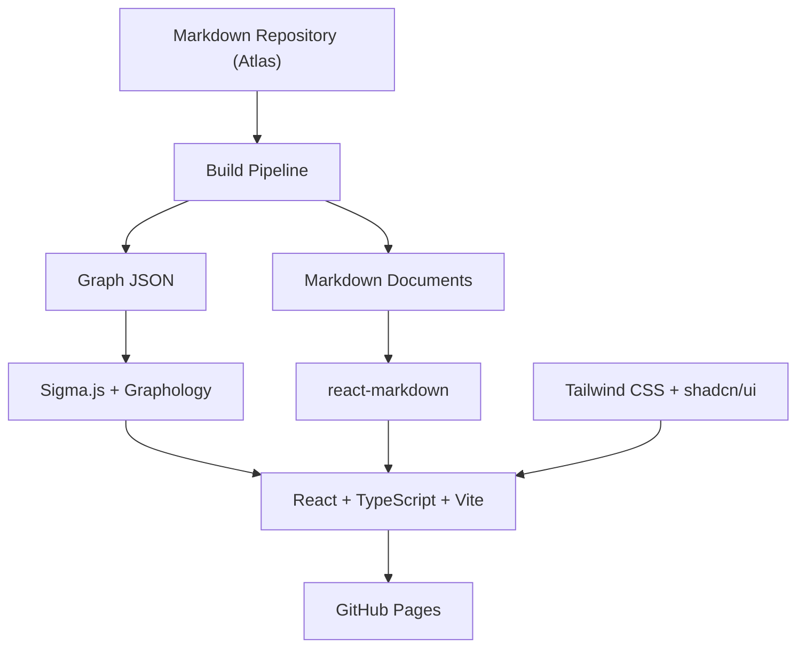
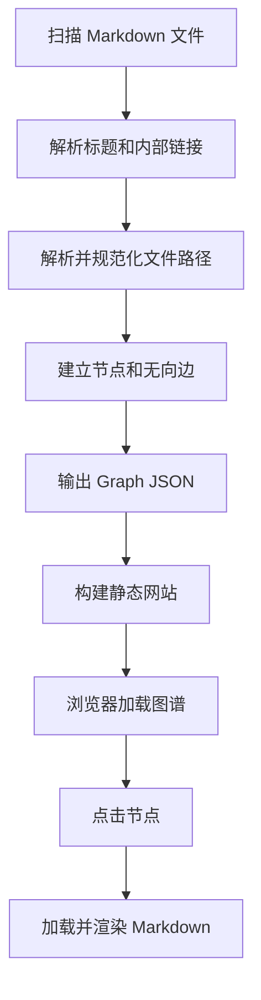
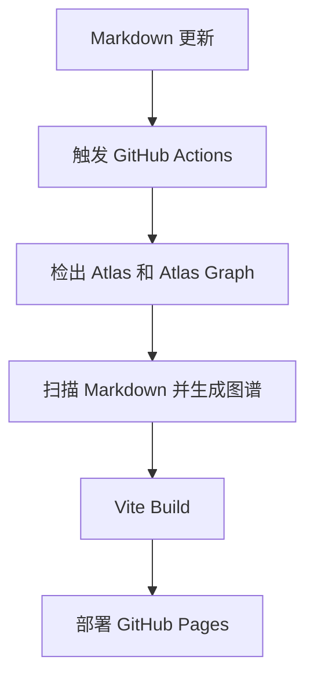

# Atlas Graph — 产品设计文档

> Version 0.2 · Graph-first Markdown Knowledge Explorer

## 1. 产品概述

### 1.1 产品定位

**Atlas Graph** 是一个开源的、以知识图谱为核心的 Markdown 知识库浏览器。

通过自动扫描 Markdown 文件之间的链接关系，构建交互式无向图，并提供 Markdown 内容阅读能力。

与传统 Markdown 阅读器不同，Atlas Graph 采用 **Graph-first（图谱优先）** 的设计理念：用户首先看到的是知识之间的关系，而不是文件目录或文章列表。

### 1.2 核心原则

- **Markdown First**：Markdown 是唯一内容数据源，不依赖数据库。
- **Graph First**：知识图谱是主界面，而不是附加功能。
- **Non-invasive**：不修改原始 Markdown，不要求专有语法。
- **Static First**：静态构建，无需后端服务。
- **Portable**：知识库独立于可视化系统，可自由迁移。
- **Open Source**：采用开源技术栈，便于扩展和维护。

### 1.3 产品目标

将传统的目录式知识浏览转变为关系式知识探索，让用户能够直观地发现、浏览和理解 Markdown 文档之间的关联。

## 2. 产品界面设计

### 2.1 整体布局

采用左右分栏设计，知识图谱始终占据主要空间。

```text
┌────────────────────────────────────────────────────────────────┐
│ Atlas Graph                              搜索  设置  全屏       │
├───────────────────────────────────────────┬────────────────────┤
│                                           │ 网球正手           │
│              全局知识图谱                 │ sports/tennis.md   │
│                                           │                    │
│          ●──────●                         │ ## 基本动作        │
│          │  \   │                         │ 转肩、降拍头、     │
│          ●──────●───●                     │ 挥拍、随挥。       │
│                                           │                    │
│              约 70%                       │ 约 30%            │
└───────────────────────────────────────────┴────────────────────┘
```

### 2.2 布局说明

| 区域 | 占比 | 职责 |
|---|---|---|
| 顶部工具栏 | 固定高度 | 搜索、设置、主题切换、全屏 |
| 左侧图谱 | 约 70% | 全局知识关系可视化 |
| 右侧阅读器 | 约 30% | 显示选中 Markdown 内容 |

桌面端默认左右分栏，支持拖动分隔线调整宽度。移动端可采用图谱全屏加抽屉式阅读面板。

### 2.3 核心交互

1. 用户进入网站，默认展示完整知识图谱。
2. 用户可以缩放、拖拽图谱和节点。
3. 点击节点，右侧展示对应 Markdown 内容。
4. 当前节点及其直接关联节点高亮。
5. 点击 Markdown 中的内部链接，自动定位到对应节点并切换阅读内容。
6. 支持搜索节点，快速定位指定知识。

## 3. 核心功能

| 模块 | 功能 | 优先级 |
|---|---|---|
| Markdown 扫描 | 递归扫描指定目录中的 `.md` 文件 | P0 |
| 链接解析 | 支持标准 Markdown 相对路径链接 | P0 |
| 图谱构建 | 文件为节点，链接为无向边 | P0 |
| 图谱渲染 | 力导向布局、缩放、拖拽 | P0 |
| Markdown 阅读 | 点击节点，在侧边栏渲染 Markdown | P0 |
| 内部链接导航 | 点击文章链接定位对应图谱节点 | P0 |
| 静态构建 | 输出 HTML、CSS、JS 和数据资源 | P0 |
| GitHub Pages | 自动部署静态网站 | P0 |
| 节点搜索 | 按文件名、标题搜索 | P1 |
| 关系高亮 | 高亮节点及其相邻节点 | P1 |
| 图谱筛选 | 根据目录、标签过滤 | P1 |
| 面板调整 | 自定义图谱与阅读器宽度 | P1 |
| 深色模式 | Light / Dark Theme | P2 |
| 布局持久化 | 保存节点位置和视图状态 | P2 |
| 全局快捷键 | 搜索、定位、导航 | P2 |

## 4. Markdown 数据规范

### 4.1 数据来源

直接读取现有 Markdown 仓库，无需额外维护知识图谱配置文件。

```text
atlas/
├── knowledge/
│   ├── sports/
│   │   ├── tennis.md
│   │   ├── forehand.md
│   │   └── badminton.md
│   └── tools/
│       ├── obsidian.md
│       └── git.md
├── projects/
├── resources/
└── README.md
```

### 4.2 链接解析

支持标准 Markdown 链接：

```markdown
# 网球

- [正手](./forehand.md)
- [反手](./backhand.md)
- [Obsidian](../tools/obsidian.md)
```

MVP 以标准 Markdown 链接为主，后续可扩展支持 Wiki-links：`[[文档名称]]`。

需要支持 URL 编码、路径归一化、锚点及相对路径解析，并区分内部 Markdown 链接与外部 URL。

### 4.3 图谱数据模型

```json
{
  "nodes": [
    {
      "id": "knowledge/sports/tennis.md",
      "label": "网球",
      "path": "knowledge/sports/tennis.md"
    },
    {
      "id": "knowledge/sports/forehand.md",
      "label": "正手",
      "path": "knowledge/sports/forehand.md"
    }
  ],
  "edges": [
    {
      "source": "knowledge/sports/tennis.md",
      "target": "knowledge/sports/forehand.md"
    }
  ]
}
```

### 4.4 构建规则

- 节点 ID 使用仓库内相对路径，避免同名文件冲突。
- 每篇 Markdown 对应一个节点，包括没有链接的孤立文档。
- 链接关系无方向，A → B 和 B → A 合并为同一条边。
- 重复链接自动去重。
- 不存在的目标文件输出构建警告。
- 优先使用 Markdown 一级标题作为节点名称，否则使用文件名。
- 默认不将目录本身视为节点。
- Markdown 内容中的内部链接应映射到图谱节点，外部链接正常打开网页。

## 5. 技术架构

### 5.1 总体架构



### 5.2 技术选型

| 层次 | 技术 | 职责 |
|---|---|---|
| 前端框架 | React + TypeScript | 应用状态、组件及交互逻辑 |
| 构建工具 | Vite | 前端构建与开发服务 |
| 样式系统 | Tailwind CSS | 页面布局、响应式设计、主题 |
| UI 组件 | shadcn/ui | 按钮、搜索、面板、弹窗等 |
| 图标 | Lucide React | 统一图标系统 |
| 图数据结构 | Graphology | 无向图、节点与边管理 |
| 图谱渲染 | Sigma.js | 高性能交互式图谱 |
| 自动布局 | ForceAtlas2 | 图谱节点布局计算 |
| Markdown 解析 | remark | 构建阶段提取链接和元数据 |
| Markdown 阅读 | react-markdown | 渲染 Markdown 内容 |
| 自动部署 | GitHub Actions | 构建和发布 |
| 静态托管 | GitHub Pages | 网站部署 |

### 5.3 技术职责划分

**React + TypeScript**

负责应用整体结构、状态管理、节点选择、文档切换以及组件之间的联动。

**Tailwind CSS**

负责整体页面布局、70/30 分栏、响应式适配、颜色、间距和主题。

**shadcn/ui**

负责图谱外围的 UI，包括：

- Button：工具栏按钮。
- Input / Command：节点搜索。
- Sheet：移动端 Markdown 阅读面板。
- Resizable：左右面板尺寸调整。
- Tooltip：节点和按钮提示。
- Dropdown Menu：图谱操作菜单。
- Dialog：设置弹窗。

shadcn/ui 的组件代码直接保存在项目中，方便定制。

**Sigma.js + Graphology**

负责图谱展示和交互，包括节点绘制、连线渲染、拖拽、缩放、节点选择与邻居高亮。

**remark + react-markdown**

remark 用于构建阶段解析 Markdown 链接，react-markdown 用于浏览器中渲染文档内容。

Markdown 中的相对链接需要通过自定义链接处理逻辑，转换为图谱内部导航行为。

### 5.4 数据处理流程



构建时生成图谱索引，运行时按需加载 Markdown 内容，避免首次加载所有文章。

## 6. 项目结构

推荐将原始知识库与图谱可视化项目分离。

```text
atlas/                          # Markdown 知识库
├── knowledge/
├── projects/
├── resources/
└── README.md

atlas-graph/                    # 图谱可视化项目
├── src/
│   ├── components/
│   │   └── ui/                 # shadcn/ui 组件
│   ├── graph/
│   │   ├── GraphView.tsx
│   │   └── graph-utils.ts
│   ├── reader/
│   │   └── MarkdownReader.tsx
│   ├── layout/
│   │   └── AppLayout.tsx
│   ├── hooks/
│   ├── lib/
│   ├── App.tsx
│   └── main.tsx
├── scripts/
│   └── build-graph.ts
├── public/
├── .github/
│   └── workflows/
│       └── deploy.yml
├── package.json
├── vite.config.ts
└── tsconfig.json
```

构建流程通过 GitHub Actions 获取 `atlas` 仓库的 Markdown 文件，并生成网站资源。

## 7. 部署方案

### 7.1 GitHub Pages

目标部署地址：

`https://username.github.io/atlas-graph/`

### 7.2 自动部署流程



当两个仓库分离时，需要通过 `repository_dispatch`、`workflow_dispatch` 或其他自动化方式触发构建；仅更新 `atlas` 仓库不会自动触发另一仓库的普通 push workflow。

Vite 需要正确配置 GitHub Pages 的 `base` 路径。

## 8. 非功能性要求

| 维度 | 要求 |
|---|---|
| 性能 | 优先支持数百至数千 Markdown 节点 |
| 扩展性 | 扫描器与图谱渲染器解耦 |
| 兼容性 | 支持现代桌面浏览器 |
| 可维护性 | TypeScript、模块化设计 |
| 数据安全 | 默认只读，不修改原始 Markdown |
| 可迁移性 | 原始知识库不依赖 Atlas Graph |
| 离线能力 | 静态资源可缓存，后续可扩展 PWA |
| 部署成本 | 无后端、无数据库、可使用免费静态托管 |

对于大型图谱，应考虑按需加载、节点过滤及布局预计算，避免在浏览器主线程上执行耗时布局。

## 9. MVP 开发范围

### P0 — 第一版必须实现

- [ ] 递归扫描 Markdown 仓库
- [ ] 提取标题和标准 Markdown 内部链接
- [ ] 构建去重无向图
- [ ] 输出 Graph JSON
- [ ] Sigma.js 渲染交互式知识图谱
- [ ] 支持图谱缩放、拖拽和节点点击
- [ ] React 左右分栏布局
- [ ] react-markdown 阅读面板
- [ ] Markdown 内部链接与图谱导航联动
- [ ] Tailwind CSS 基础样式
- [ ] shadcn/ui 基础交互组件
- [ ] GitHub Pages 自动部署

### P1 — 体验优化

节点搜索、邻居高亮、目录和标签筛选、面板宽度调整、移动端适配。

### P2 — 后续增强

深色模式、布局持久化、快捷键、Wiki-links、图谱截图导出、PWA 离线浏览。

## 10. 暂不实现

第一版明确不包含：

- Markdown 在线编辑。
- 用户账号与权限管理。
- 数据库和后端 API。
- AI 自动生成知识关系。
- 向量检索或 RAG。
- 多人协作。
- 实时文件同步。

这些功能不属于 Graph-first Markdown 阅读器的核心闭环。

## 11. 产品成功标准

Atlas Graph 第一版完成后，应能够实现以下用户体验：

用户将现有 Markdown 仓库接入 Atlas Graph，执行一次静态构建，即可在 GitHub Pages 上获得一个以全局知识图谱为首页的网站。

用户可以通过拖拽、缩放、搜索和点击节点探索知识关系，并在右侧面板直接阅读 Markdown 内容，无需跳转到其他应用。

新增 Markdown 文件或修改内部链接后，重新构建即可更新图谱。

## 12. 最终技术方案

| 层次 | 技术 |
|---|---|
| 前端 | React + TypeScript |
| 构建 | Vite |
| 样式 | Tailwind CSS |
| UI 组件 | shadcn/ui |
| 图标 | Lucide React |
| 图谱 | Sigma.js + Graphology + ForceAtlas2 |
| Markdown | remark + react-markdown |
| 部署 | GitHub Pages |
| 自动化 | GitHub Actions |

**最终定位：** Atlas Graph 不负责创造或管理 Markdown 内容，而是作为独立的可视化展示层，将 Markdown 文件之间的链接转化为可探索的知识网络。

**核心价值：以图谱探索知识，以 Markdown 保存知识。**
