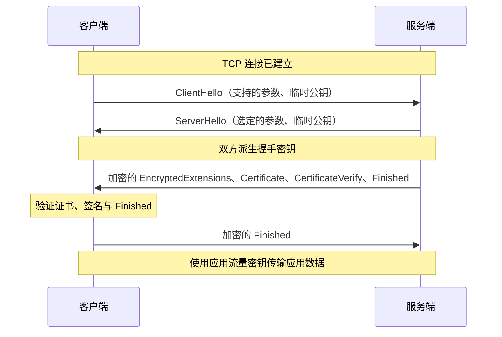

# TLS

## 1. 基本概念

TLS（Transport Layer Security，传输层安全协议）为通信提供机密性、完整性与身份认证，可用于 HTTP、数据库连接、邮件等场景。HTTP 使用 TLS 保护通信时，称为 HTTPS；相关协议栈和部署方式见 [HTTP：HTTPS](../networks/http.md#9-https)。

RSA、DH、ECDH、ECDHE 等算法的原理与区别见 [密码学学习笔记](cryptography.md)。

## 2. 版本演进

TLS 是 SSL 的后继协议，职责基本相同，但握手、密钥派生、消息认证和支持的算法随版本演进而变化，并非只是更名。参见 [TLS 1.0 标准](https://www.rfc-editor.org/rfc/rfc2246.html)。

```text
SSL 2.0 → SSL 3.0 → TLS 1.0 → TLS 1.1 → TLS 1.2 → TLS 1.3
```

SSL 已淘汰，TLS 1.0 和 1.1 也已弃用。参见 [SSL 3.0 弃用标准](https://www.rfc-editor.org/rfc/rfc7568.html)和 [TLS 1.0 / 1.1 弃用标准](https://www.rfc-editor.org/rfc/rfc8996.html)。

一条连接协商使用某个具体协议版本，不会叠加使用 SSL 和 TLS。“SSL 证书”通常是沿用的名称，不表示连接使用 SSL。

## 3. TLS 1.3 握手流程

下面展示基于 TCP、服务端证书认证的典型完整握手，省略客户端证书认证、重试与会话恢复：



`CertificateVerify` 证明私钥持有权，`Finished` 校验握手上下文与密钥。TLS 1.3 在 `ServerHello` 之后加密后续握手消息。上述握手通常需要 1 个 TLS 往返，不包含 TCP 建连耗时。参见 [RFC 8446：握手协议](https://www.rfc-editor.org/rfc/rfc8446.html#section-4)。

证书验证的具体检查项见 [数字证书与信任链](#4-数字证书与信任链)。

## 4. 数字证书与信任链

证书将域名等身份信息与公钥绑定，由证书颁发机构（CA）签名。客户端通常从服务端证书，经中间 CA，构建到本地信任根的证书链。

以 HTTPS 的服务端证书验证为例，客户端需要检查：

1. 证书链的签名与约束是否有效，能否连接到受信任的根。
2. 访问的主机名是否匹配证书中的身份信息。
3. 证书是否在有效期内，以及是否满足用途等要求。
4. 按客户端策略处理证书吊销状态。

根证书受信任，是因为它被预先纳入信任库或由管理员配置，而非仅仅因为它是自签名证书。服务端通常发送站点证书与中间证书，客户端使用自己的信任库完成验证。参见 [RFC 9110：证书验证](https://www.rfc-editor.org/rfc/rfc9110.html#section-4.3.4)。

## 5. TLS 1.2 与 TLS 1.3 的区别

### 5.1 核心对比

下表的握手比较以基于 TCP、服务端证书认证的完整握手为主，不包含会话恢复：

| 对比项 | TLS 1.2 | TLS 1.3 |
| --- | --- | --- |
| 密钥交换 | 支持 RSA 密钥传输、ECDHE 等 | 移除 RSA 密钥传输，证书认证的完整握手使用临时 DH/ECDH |
| 证书私钥用途 | RSA 密钥传输时解密预主秘密；ECDHE 时签名认证 | 签名认证，不用于解密预主秘密 |
| 完整握手 | 通常 2-RTT | 通常 1-RTT |
| 握手加密 | 初次完整握手中的证书等消息通常明文发送 | `ServerHello` 之后的握手消息加密 |
| 对称加密 | 支持 AEAD，也有 CBC 等旧方案 | 只使用 AEAD |
| 密钥派生 | 使用 PRF 派生主秘密和记录层密钥材料 | 使用 HKDF 分阶段派生握手与应用流量密钥 |
| 会话恢复 | 支持缩短握手 | 支持 PSK 恢复，可选 0-RTT 早期数据 |

RTT 不包含 TCP 建连耗时；TLS 1.3 若需要 `HelloRetryRequest`，会增加往返。TLS 1.3 也支持 PSK 模式，不能将所有连接都概括为证书认证加 ECDHE。参见 [RFC 8446：与 TLS 1.2 的主要区别](https://www.rfc-editor.org/rfc/rfc8446.html#section-1.2)。

### 5.2 为什么握手少了一轮

TLS 1.2 的典型完整握手中，服务端先返回证书等信息，客户端随后通过 `ClientKeyExchange` 发送密钥交换材料，服务端再回复 `Finished`：

```text
客户端 → 服务端：ClientHello
服务端 → 客户端：ServerHello、Certificate、[ServerKeyExchange]、ServerHelloDone
客户端 → 服务端：ClientKeyExchange、ChangeCipherSpec、Finished
服务端 → 客户端：ChangeCipherSpec、Finished
```

这里省略客户端证书认证；ECDHE 使用 `ServerKeyExchange` 携带服务端临时公钥等参数，RSA 密钥传输不发送该消息。`ChangeCipherSpec` 是独立协议消息，`Finished` 是受加密保护的握手消息。参见 [RFC 5246：握手概述](https://www.rfc-editor.org/rfc/rfc5246.html#section-7.3)。

TLS 1.3 通常在 `ClientHello` 中就发送临时公钥，服务端可连续返回 `ServerHello` 和加密的证书、签名、`Finished`，无需等待客户端再发密钥交换消息。

服务端的 `ServerHello`、`EncryptedExtensions`、`Certificate`、`CertificateVerify`、`Finished` 是五条握手消息，但属于同一轮回复。前文时序图分成两条箭头，是为了区分明文与加密阶段，不代表两轮交互，也不对应固定数量的 TCP 包。

## 6. 会话恢复与 0-RTT

会话恢复可利用先前建立的密钥材料减少握手开销。TLS 1.3 还允许符合条件的客户端发送 0-RTT 早期数据，但存在重放风险，应用必须判断操作是否可以安全重复执行；不能仅因数据已加密，就认为付款、创建订单等操作可以安全重放。参见 [RFC 8446：0-RTT](https://www.rfc-editor.org/rfc/rfc8446.html#section-2.3)。

## 7. 双向 TLS（mTLS）

常见 TLS 连接由客户端验证服务端证书；mTLS 还要求客户端提供证书并证明持有对应私钥，由服务端验证客户端身份。服务端可在握手中通过 `CertificateRequest` 请求客户端认证。参见 [RFC 8446：客户端认证](https://www.rfc-editor.org/rfc/rfc8446.html#section-4.3.2)。

mTLS 常用于服务间身份认证。证书通过验证后，应用仍需决定该身份可以访问哪些资源；身份认证不会自动完成业务授权。
