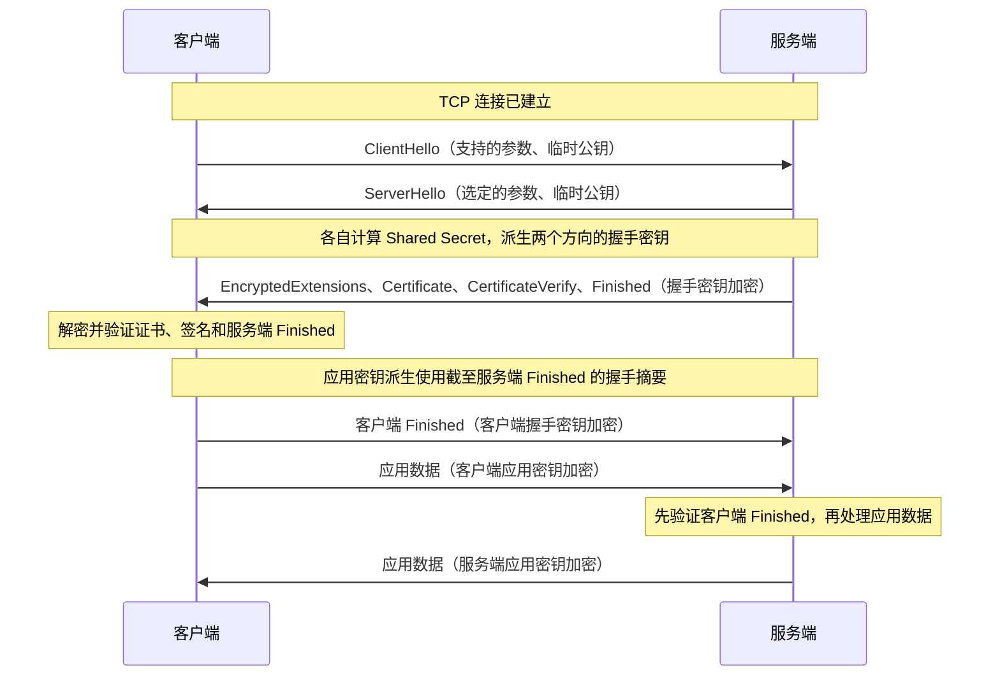

# TLS

## 1. 基本概念

TLS（Transport Layer Security，传输层安全协议）为通信提供机密性、完整性与身份认证，可用于 HTTP、数据库连接、邮件等场景。HTTP 使用 TLS 保护通信时，称为 HTTPS；相关协议栈和部署方式见 [HTTP：HTTPS](../networks/http.md#9-https)。

RSA、DH、ECDH、ECDHE 等算法的原理与区别见 [密码学学习笔记](cryptography.md)。

## 2. 版本演进

TLS 是 SSL 的后继协议，职责基本相同，但握手、密钥派生、消息认证和支持的算法随版本演进而变化，并非只是更名。参见 [TLS 1.0 标准](https://www.rfc-editor.org/rfc/rfc2246.html)。

```text
SSL 2.0 → SSL 3.0 → TLS 1.0 → TLS 1.1 → TLS 1.2 → TLS 1.3
```

SSL 已淘汰，TLS 1.0 和 1.1 也已弃用。参见 [SSL 3.0 弃用标准](https://www.rfc-editor.org/rfc/rfc7568.html)和 [TLS 1.0 / 1.1 弃用标准](https://www.rfc-editor.org/rfc/rfc8996.html)。

一条连接协商使用某个具体协议版本，不会叠加使用 SSL 和 TLS。“SSL 证书”通常是沿用的名称，不表示连接使用 SSL。

## 3. TLS 1.3 握手流程

以下以 TCP 已建立、使用 ECDHE 和服务端证书认证的完整握手为例，不包含客户端证书认证、HelloRetryRequest、PSK 与会话恢复。这里只说明密钥在协议中的来源和用途，算法原理见 [密码学学习笔记](cryptography.md)。

### 3.1 整体流程



服务端的五条握手消息属于同一轮回复，中间不等客户端回应。图中将 `ServerHello` 单列，是因为它是明文，后四条握手消息是加密的；箭头数量不代表 TCP 包的数量。

这是典型的 1-RTT 握手，不包含 TCP 建连时间。图中按请求与响应展示应用数据；协议也允许服务端在发送自己的 Finished 后发送应用数据。

### 3.2 交换 Hello 与派生握手密钥

客户端通过 `ClientHello` 提供支持的版本、算法和临时公钥等参数。服务端通过 `ServerHello` 返回选定参数及自己的临时公钥。双方各自计算相同的 Shared Secret，私钥和 Shared Secret 不直接传输。

握手密钥的派生关系简化如下，箭头代表协议规定的派生步骤：

```text
Early Secret（本例无 PSK，使用规定的零值输入）
    ↓ 派生后结合 ECDHE Shared Secret
Handshake Secret
    ↓ 结合 Hash(ClientHello || ServerHello)
Client Handshake Traffic Secret / Server Handshake Traffic Secret
    ↓ 分别派生
各方向的握手加密密钥、IV、Finished 校验密钥
```

本节中的 `Secret` 用于继续派生密钥，不直接作为加密密钥。证书私钥用于身份认证，不参与这里的 Shared Secret 计算。

双方能派生出两个方向的对应密钥：“服务端握手密钥”指服务端发送、客户端接收时使用的同一把密钥，并非只有服务端拥有它。客户端方向同理。

### 3.3 服务端的协商结果与身份证明

以下三条消息均使用服务端握手加密密钥保护，客户端用自己派生出的对应密钥解密：

| 消息 | 内容与作用 |
| --- | --- |
| EncryptedExtensions | 其他协商结果，例如选用的应用协议 |
| Certificate | 服务端证书链，让客户端验证身份与公钥的绑定 |
| CertificateVerify | 用证书私钥签署握手上下文，证明当前对端持有该私钥 |

“握手上下文”指此前按顺序交换的握手消息。此处签名使用的握手摘要覆盖：

```text
ClientHello → ServerHello → EncryptedExtensions → Certificate
```

签名输入还包含协议规定的固定前缀和服务端上下文标识。客户端使用证书公钥验签，同时检查证书是否可信、身份是否匹配；检查项见 [数字证书与信任链](#4-数字证书与信任链)。

### 3.4 服务端 Finished 的生成与校验

Finished 是握手的最终核对消息，其内容是 HMAC 校验值，不是证书私钥生成的数字签名。

```text
服务端 Finished 校验值 = HMAC(
    服务端 Finished 校验密钥,
    Hash(ClientHello ... 服务端 CertificateVerify)
)
```

校验密钥从 Server Handshake Traffic Secret 使用 `"finished"` 标签派生。摘要覆盖此前完整的握手消息编码，包含握手消息头，不包含 TLS 记录头，也不包含当前这条 Finished。

客户端分两步验证：

1. 用服务端握手加密密钥解密记录并验证认证标签，取得 Finished 中的校验值。
2. 用服务端 Finished 校验密钥和自己记录的握手消息重算校验值，与收到的值比较；不一致则终止连接。

握手加密密钥负责保护传输，Finished 校验密钥负责核对握手内容和密钥材料，两者是分别派生的。

### 3.5 派生应用密钥

应用密钥来自 Handshake Secret 的另一条派生分支：

```text
Handshake Secret
    ↓ 进一步派生
Master Secret
    ↓ 结合 Hash(ClientHello ... 服务端 Finished)
Client Application Traffic Secret / Server Application Traffic Secret
    ↓ 分别派生
客户端应用密钥和 IV / 服务端应用密钥和 IV
```

这里的摘要包含服务端 Finished，因此无需等待客户端 Finished 才能派生应用密钥。双方拥有相同的 Secret 和握手记录，能各自得到对应密钥，不需要传输应用密钥。

| 密钥 | 客户端用途 | 服务端用途 |
| --- | --- | --- |
| 客户端应用密钥 | 加密发送 | 解密接收 |
| 服务端应用密钥 | 解密接收 | 加密发送 |

两个发送方向使用不同密钥，但发送方的加密密钥与接收方对应的解密密钥一致。

### 3.6 客户端 Finished 与应用数据

客户端验证服务端 Finished 后，生成自己的 Finished。本例没有客户端证书，因此计算范围截至服务端 Finished：

```text
客户端 Finished 校验值 = HMAC(
    客户端 Finished 校验密钥,
    Hash(ClientHello ... 服务端 Finished)
)
```

客户端用客户端握手加密密钥发送 Finished，随后可以立即用客户端应用密钥发送应用数据，无需再等服务端回复。它们属于不同的 TLS 记录，可以连续发送，甚至位于同一个 TCP 包中。

服务端用客户端方向的对应密钥解密、重算并校验 Finished，通过后处理应用数据。记录加解密还使用 nonce，由该方向、该密钥下的记录序号与派生 IV 构造；认证标签验证失败时拒绝记录。

本节协议细节参见 [RFC 8446：握手协议](https://www.rfc-editor.org/rfc/rfc8446.html#section-4)、[Finished](https://www.rfc-editor.org/rfc/rfc8446.html#section-4.4.4)与 [密钥派生](https://www.rfc-editor.org/rfc/rfc8446.html#section-7.1)。

## 4. 数字证书与信任链

### 4.1 数字证书

数字证书将域名等身份信息与公钥绑定，由证书颁发机构（CA）签名。网站证书通常包含域名、公钥、有效期、签发者以及签发者的数字签名，不包含网站私钥。

证书可以公开，也可以被复制。因此，客户端既要验证证书是否可信，也要确认当前通信对端确实持有对应私钥。

### 4.2 信任链与证书验证

客户端通常从服务端证书，经中间 CA，构建到本地信任根的证书链：

```text
受信任的根 CA
    ↓ 签发
中间 CA 证书
    ↓ 签发
网站证书（域名、公钥等）
```

客户端从网站证书开始，验证签发者的签名，并沿证书链向上验证，直到连接到本地信任库中的根 CA。

以 HTTPS 的服务端证书验证为例，客户端需要检查：

1. 证书链的签名与约束是否有效，能否连接到受信任的根。
2. 访问的主机名是否匹配证书中的身份信息。
3. 证书是否在有效期内，以及是否满足用途等要求。
4. 按客户端策略处理证书吊销状态。

根证书受信任，是因为它被预先纳入信任库或由管理员配置，而非仅仅因为它是自签名证书。服务端通常发送站点证书与中间证书，客户端使用自己的信任库完成验证。参见 [RFC 9110：证书验证](https://www.rfc-editor.org/rfc/rfc9110.html#section-4.3.4)。

### 4.3 服务端证明与客户端验证

在本节讨论的 TLS 1.3 服务端证书认证中，服务端提供证明，客户端分两步验证：

| 步骤 | 服务端提供什么 | 客户端如何验证 | 确认什么 |
| --- | --- | --- | --- |
| Certificate | 网站证书与中间证书 | 验证信任链、域名、有效期与用途等 | 证书中的公钥是否可信地属于目标网站 |
| CertificateVerify | 用证书对应私钥对本次握手上下文生成的签名 | 使用已验证证书中的公钥验签 | 当前对端是否持有对应私钥，并将身份绑定到本次握手 |

```text
服务端：证书私钥 + 本次握手上下文 → 生成签名
    ↓ 通过 CertificateVerify 发送
客户端：已验证证书中的公钥 + 本次握手上下文 + 签名 → 验签
```

证书上的签名由 CA 生成，提供身份与公钥的可信绑定；CertificateVerify 中的签名由服务端在本次握手中生成，证明私钥持有权。签名覆盖的具体内容见 [服务端的协商结果与身份证明](#33-服务端的协商结果与身份证明)。

复制公开的网站证书并不能完成这一证明，因为攻击者还需要对应私钥。普通服务端证书认证不要求客户端提供证书；需要双方提供证书认证时，使用 [双向 TLS（mTLS）](#7-双向-tlsmtls)。

## 5. TLS 1.2 与 TLS 1.3 的区别

### 5.1 核心对比

下表的握手比较以基于 TCP、服务端证书认证的完整握手为主，不包含会话恢复：

| 对比项 | TLS 1.2 | TLS 1.3 |
| --- | --- | --- |
| 密钥交换 | 支持 RSA 密钥传输、ECDHE 等 | 移除 RSA 密钥传输，证书认证的完整握手使用临时 DH/ECDH |
| 证书私钥用途 | RSA 密钥传输时解密 Pre-Master Secret；ECDHE 时签名认证 | 签名认证，不用于解密 Pre-Master Secret |
| 完整握手 | 通常 2-RTT | 通常 1-RTT |
| 握手加密 | 初次完整握手中的证书等消息通常明文发送 | `ServerHello` 之后的握手消息加密 |
| 对称加密 | 支持 AEAD，也有 CBC 等旧方案 | 只使用 AEAD |
| 密钥派生 | 使用 PRF 派生 Master Secret 和记录层密钥材料 | 使用 HKDF 分阶段派生握手与应用流量密钥 |
| 会话恢复 | 支持缩短握手 | 支持 PSK 恢复，可选 0-RTT 早期数据 |

RTT 不包含 TCP 建连耗时；TLS 1.3 若需要 `HelloRetryRequest`，会增加往返。TLS 1.3 也支持 PSK 模式，不能将所有连接都概括为证书认证加 ECDHE。参见 [RFC 8446：与 TLS 1.2 的主要区别](https://www.rfc-editor.org/rfc/rfc8446.html#section-1.2)。

### 5.2 为什么握手少了一轮

TLS 1.2 的典型完整握手中，服务端先返回证书等信息，客户端随后通过 `ClientKeyExchange` 发送密钥交换材料，服务端再回复 `Finished`：

```text
客户端 → 服务端：ClientHello
服务端 → 客户端：ServerHello、Certificate、[ServerKeyExchange]、ServerHelloDone
客户端 → 服务端：ClientKeyExchange、ChangeCipherSpec、Finished
服务端 → 客户端：ChangeCipherSpec、Finished
```

这里省略客户端证书认证；ECDHE 使用 `ServerKeyExchange` 携带服务端临时公钥等参数，RSA 密钥传输不发送该消息。`ChangeCipherSpec` 是独立协议消息，`Finished` 是受加密保护的握手消息。参见 [RFC 5246：握手概述](https://www.rfc-editor.org/rfc/rfc5246.html#section-7.3)。

TLS 1.3 通常在 `ClientHello` 中就发送临时公钥，服务端可连续返回 `ServerHello` 和加密的证书、签名、`Finished`，无需等待客户端再发密钥交换消息。

服务端的 `ServerHello`、`EncryptedExtensions`、`Certificate`、`CertificateVerify`、`Finished` 是五条握手消息，但属于同一轮回复。前文时序图将这些消息分成两条箭头，是为了区分明文与加密阶段，不代表两轮交互，也不对应固定数量的 TCP 包。

## 6. 会话恢复与 0-RTT

会话恢复可利用先前建立的密钥材料减少握手开销。TLS 1.3 还允许符合条件的客户端发送 0-RTT 早期数据，但存在重放风险，应用必须判断操作是否可以安全重复执行；不能仅因数据已加密，就认为付款、创建订单等操作可以安全重放。参见 [RFC 8446：0-RTT](https://www.rfc-editor.org/rfc/rfc8446.html#section-2.3)。

## 7. 双向 TLS（mTLS）

常见 TLS 连接由客户端验证服务端证书；mTLS 还要求客户端提供证书并证明持有对应私钥，由服务端验证客户端身份。服务端可在握手中通过 `CertificateRequest` 请求客户端认证。参见 [RFC 8446：客户端认证](https://www.rfc-editor.org/rfc/rfc8446.html#section-4.3.2)。

mTLS 常用于服务间身份认证。证书通过验证后，应用仍需决定该身份可以访问哪些资源；身份认证不会自动完成业务授权。
