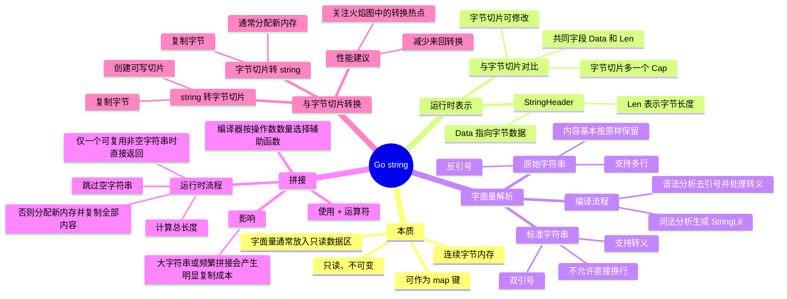

# Go string 思维导图

```mermaid
mindmap
  root((Go string))
    本质
      连续字节内存
      只读、不可变
      字面量通常放入只读数据区
      可作为 map 键
    运行时表示
      StringHeader
        Data 指向字节数据
        Len 表示字节长度
      与字节切片对比
        共同字段 Data 和 Len
        字节切片多一个 Cap
        字节切片可修改
    字面量解析
      标准字符串
        双引号
        支持转义
        不允许直接换行
      原始字符串
        反引号
        支持多行
        内容基本按原样保留
      编译流程
        词法分析生成 StringLit
        语法分析去引号并处理转义
    拼接
      使用 + 运算符
      编译器按操作数数量选择辅助函数
      运行时流程
        跳过空字符串
        计算总长度
        仅一个可复用非空字符串时直接返回
        否则分配新内存并复制全部内容
      影响
        大字符串或频繁拼接会产生明显复制成本
    与字节切片转换
      字节切片转 string
        通常分配新内存
        复制字节
      string 转字节切片
        创建可写切片
        复制字节
      性能建议
        减少来回转换
        关注火焰图中的转换热点
```

## 实战结论

`string` 适合表达稳定文本；需要频繁修改、拼接或处理字节时，优先使用字节切片或 `strings.Builder` 聚合，最后再转换为 `string`。
